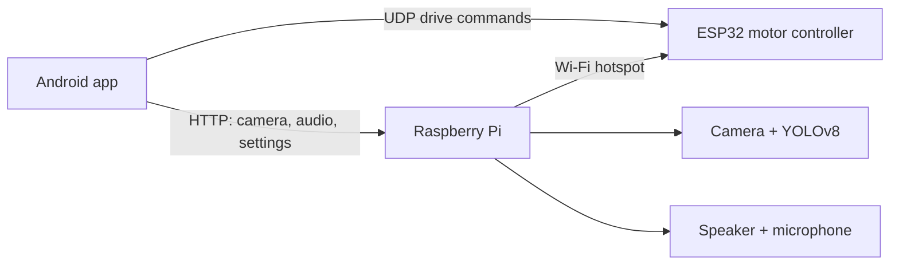

# C.A.T.S.: Search and Rescue Robot System

An adaptive search-and-rescue robotic car built as an academic thesis project. A phone app drives the robot, streams its live camera feed with on-board human/animal detection, and supports two-way audio so rescuers can talk to and listen around the robot.

## Features

- **Remote driving** from an Android app, with held-button control, three speed modes, and a deadman safety that stops the motors if the connection drops
- **Live camera feed** (MJPEG) with real-time **YOLOv8 object detection** (human / animal) running on a Raspberry Pi
- **Two-way audio**: talk through the robot's speaker, or listen through its microphone
- **Alarm buzzer, light, and photo capture** controlled from the app
- **Safe remote shutdown** of the Raspberry Pi
- **Customizable control layout**: buttons can be moved and resized and the layout is saved
- **Hardware**: Raspberry Pi, ESP32, LiDAR, camera, gas sensor, and BTS7960 motor drivers

## How it works

The Raspberry Pi hosts a Wi-Fi hotspot. The ESP32 and the phone both join it.

| Component | What it does |
|---|---|
| `android-app/` | Kotlin + Jetpack Compose controller app: driving, camera view, audio, settings |
| `raspberry-pi/live5.py` | Captures camera frames, runs YOLOv8 detection, serves the annotated MJPEG stream |
| `raspberry-pi/audio_server.py` | Flask + socket server for announcements, talk/listen audio, volume, buzzer, and shutdown |
| `esp32/CATS_ESP32/` | Firmware that drives the drive and steering motors from UDP packets, with deadman and Wi-Fi-loss safety stops |

## Tech stack

- **App**: Kotlin, Jetpack Compose, OkHttp
- **Raspberry Pi**: Python, Picamera2, OpenCV, Ultralytics YOLOv8 (NCNN), Flask
- **ESP32**: Arduino C++, UDP, BTS7960 motor drivers

## Setup notes

1. **ESP32**: open `esp32/CATS_ESP32/CATS_ESP32.ino` and set `ssid` and `password` to your Raspberry Pi hotspot's credentials before flashing.
2. **Raspberry Pi**: install the dependencies (`picamera2`, `opencv-python`, `ultralytics`, `flask`, plus `espeak-ng` and `alsa-utils`), then run `live5.py` and `audio_server.py`. Check the audio device settings at the top of `audio_server.py` against `aplay -l` and `arecord -l`.
3. **Android app**: open `android-app/` in Android Studio, build, and install on a phone connected to the robot's hotspot.

The trained detection model is not included in this repository.

## Credits

Thesis project by Joshua Aeron J. Adormeo, Luke Joshua R. Cahinusayan, and Hannz Jimdandy R. Naag, Manuel S. Enverga University Foundation.